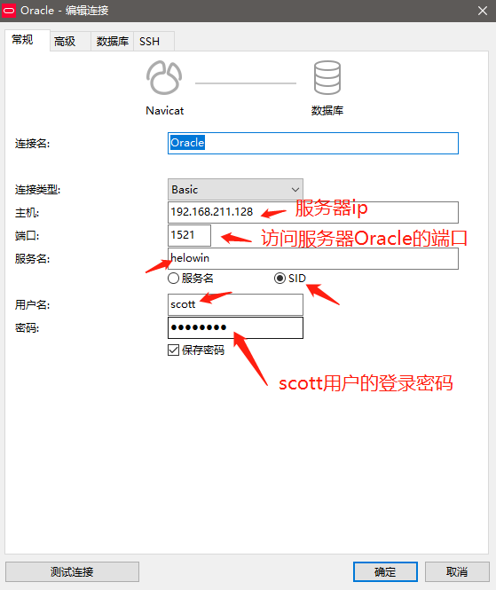

# jfoenix-javafx-Oracle-schoollibrary

大型数据库系统应用课程设计-Gdufe图书管理系统

## 项目说明

本项目是基于软件工程课程设计项目修改的，将原本的数据库MySQL改成Oracle，原项目地址：[jfoenix-javafx-mysql-schoollibrary](https://github.com/Acgoto/jfoenix-javafx-mysql-schoollibrary)。
注意：jfoenix-javafx的配置请参照原项目地址！

## 可选配置
1、在自己的服务器（例如我的是centos7.x）搭建好Docker环境，先拉取一个镜像：`docker pull registry.cn-hangzhou.aliyuncs.com/helowin/oracle_11g`。注意，拉取过程耗时稍微有点长，一共分3层拉取下载，大小是6个多G。

2、运行一个Oracle容器实例：`docker run -d -p 1521:1521 --name oracle_11g registry.cn-hangzhou.aliyuncs.com/helowin/oracle_11g`

3、启动容器：`docker start oracle_11g`

4、进入容器终端：`docker exec -it oracle_11g bash`

5、切换管理员用户：`su - root`，密码：`helowin`

6、添加启动Oracle到系统环境变量，编辑文件：`vi /etc/profile`，添加以下内容，然后保存并退出。

```bash
export ORACLE_HOME=/home/oracle/app/oracle/product/11.2.0/dbhome_2
export ORACLE_SID=helowin
export PATH=$ORACLE_HOME/bin:$PATH
```

7、添加软件链接：`ln -s $ORACLE_HOME/bin/sqlplus /usr/bin`

8、切换到普通用户：`su - oracle`

9、启动sqlplus但不连接数据库：`sqlplus /nolog`，然后以超管身份登录：`conn /as sysdba`

10、开启`scott`用户，并修改`sys`、`system`、`scott`用户的密码：
```sql
-- 解锁scott用户
alter user scott account unlock;
-- 设置登录密码
alter user scott identified by 123456;
alter user system identified by 123456;
alter user sys identified by 123456;
-- 设置用户的密码有效期为无限制
ALTER PROFILE DEFAULT LIMIT PASSWORD_LIFE_TIME UNLIMITED;
```

11、使用navicat软件连接Oracle并登录，注意：主机设置为你的服务器ip


12、若测试连接成功之后，在shell终端输入`exit`，此命令会断开与数据库的连接，同时会退出sql/plus。接下来按组合键`Ctrl+P+Q`回到宿主机界面后容器仍在后台运行。

## 快速上手
1、在scott用户下，点击界面左上角的“新建查询”，然后从`oracle.sql`中依次从上到下执行创建表并导入表数据、创建Oracle数据库对象。

2、将此项目导入IDEA编辑器中，注意：需要手动安装ojdbc6.jar包到maven本地仓库。首先将`ojdbc6.jar`放在maven本地仓库的根路径，例如我自己的配置是：`E:\maven_repository`，在当前路径下打开`cmd`，执行命令`mvn install:install-file -Dfile=E:/maven_repository/ojdbc6.jar -DgroupId=com.oracle -DartifactId=ojdbc6 -Dversion=11.2.0.3.0 -Dpackaging=jar -DgeneratePom=true`，之后就会看到绿色的<font color=green >BUILD SUCCESS</font>，说明安装成功了。然后在pom.xml文件里添加依赖，当然我在项目中已经配置好了。
```xml
<dependency>
    <groupId>com.oracle</groupId>
    <artifactId>ojdbc6</artifactId>
    <version>11.2.0.3.0</version>
</dependency>
```

3、接下来修改配置文件：schoolLibrary\src\main\resources\config\druid.properties中的`url`、`username`、`password`，改完即可运行本项目！